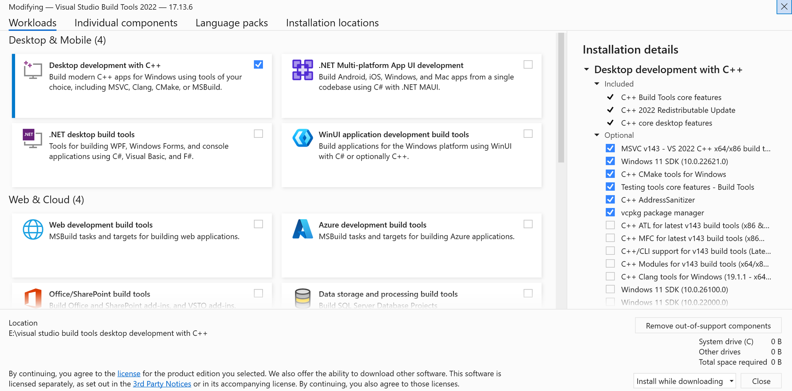

# 🌱 SESAME Project

## 🌍 About

The **SESAME project** aims to unify key human and non-human (Earth system) datasets into a shared spatially-gridded format. These datasets are often siloed in incompatible formats; SESAME bridges that gap to accelerate scientific discovery and interdisciplinary modeling.

## 🎯 Goals

- Unify human and non-human system datasets in a standardized spatially-gridded structure.
- Improve data discoverability and interoperability for research and modeling.
- Support interdisciplinary science through accessible, integrated datasets.

---

## 🗺️ Human-Earth Atlas

📂 **Atlas Data Access**:  
[https://doi.org/10.6084/m9.figshare.28432499](https://doi.org/10.6084/m9.figshare.28432499)

📖 **Atlas Citation**:  
Faisal, A. A., Kaye, M., Ahmed, M. & Galbraith, E. _The SESAME Human-Earth Atlas_. figshare (2025).  
[https://doi.org/10.6084/m9.figshare.28432499](https://doi.org/10.6084/m9.figshare.28432499)

---

## 📄 Publications

Faisal, A.A., Kaye, M., Ahmed, M. et al. (2025).  
_The SESAME Human-Earth Atlas_. *Scientific Data*, 12, 775.  
[https://doi.org/10.1038/s41597-025-05087-5](https://doi.org/10.1038/s41597-025-05087-5)

---

## 📚 Software Documentation

Detailed setup, usage instructions, advanced features, and testing procedures are included in the official software manual:

📄 [**SESAME Software Manual (v1.1)**](docs/SESAME-Software_Manual_v1.1.pdf)

---

## ⚙️ Installation Instructions

If you're using **conda** to manage your Python environment:

### Step 1: Create and activate the environment

```bash
# create a new conda environment
conda create -n sesame_env
# activate the environment
conda activate sesame_env
# install pip
conda install pip
# install SESAME from pip
pip install sesame
```
### Step 2: Add this as a Python code snippet:
```bash
import sesame as ssm 
```

### If you are using Windows and encounter the error: 
“ERROR: Failed building wheel for cartopy,” please follow these steps:

1. Download and install the Microsoft C++ Build Tools from the official website:  
   [https://visualstudio.microsoft.com/visual-cpp-build-tools/](https://visualstudio.microsoft.com/visual-cpp-build-tools/)

2. During installation, make sure to select the **"Desktop development with C++"** workload.  
   This is required to build packages like cartopy that depend on C++ extensions.




## 🧪 Testing SESAME

To verify the functionality of the SESAME toolbox, a Jupyter notebook is provided:

📓 [Test Notebook: `test/test_sesametoolbox.ipynb`](test/test_sesametoolbox.ipynb)

This notebook demonstrates core features using sample datasets located in:

📁 `test/data/`

### 📌 To run the test:

1. Make sure your environment is activated:
    ```bash
    conda activate sesame_env
    ```

2. Install Jupyter (if you haven't already):
    ```bash
    conda install jupyter
    ```

3. Launch the notebook:
    ```bash
    jupyter notebook test/test_sesametoolbox.ipynb
    ```

4. Follow the instructions in the notebook to run sample tests.

> 🔍 **Note:** Ensure that all paths in the notebook refer to `test/data/` correctly. The folder structure must be preserved when cloning or downloading the repository.

## Contact
For questions or inquiries about the SESAME project, please contact [abdullah-al.faisal@mail.mcgill.ca](mailto:abdullah-al.faisal@mail.mcgill.ca).
